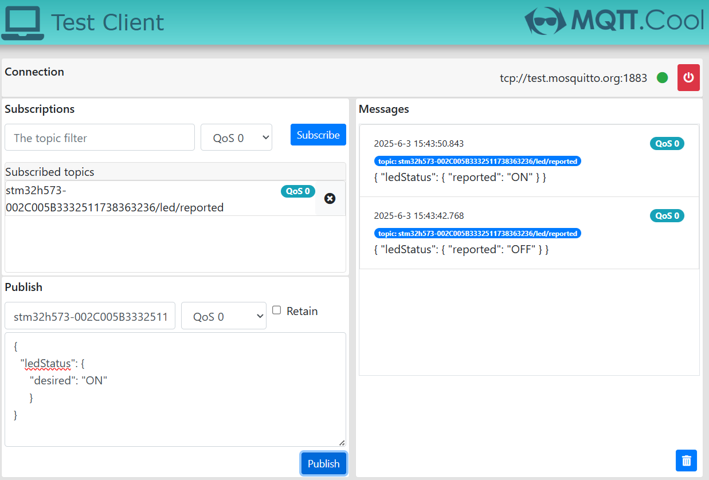
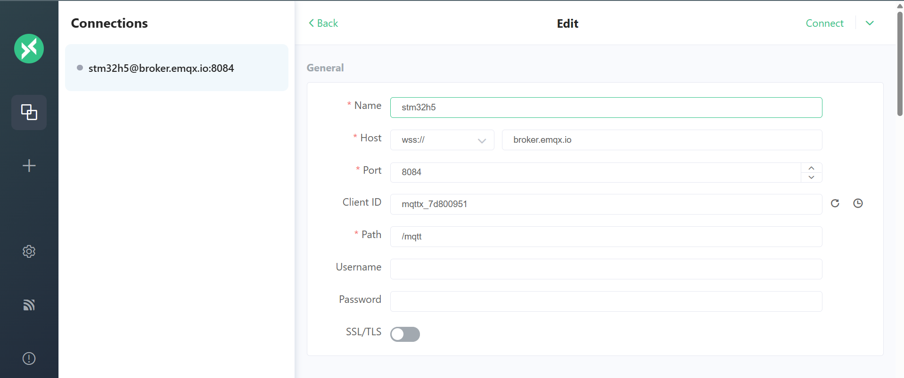
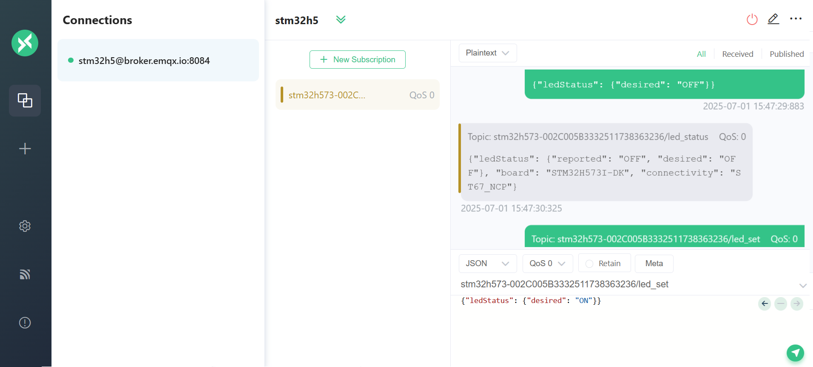

# LED Control Example (`led_task.c`)

This example demonstrates how to control the onboard LED of the STM32 board via MQTT messages. The LED state can be remotely set (ON/OFF) by publishing to a specific MQTT topic, and the board will report its current LED status back to another topic.

---

## How It Works

- The firmware subscribes to the `< ThingName >/led/desired` topic for desired LED state changes.
- When a message is received (ON or OFF), the onboard LED is updated accordingly.
- The board then publishes its current LED status to the `< ThingName >/led/reported` topic in JSON format.

- The `ThingName` depends on your project configuration
- Examples:
    * Without STSAFE : `stm32h573-002C005B3332511738363236`
    * With STSAFEA-110: `eval3-0102203B825BD42BC20554`
    * With STSAFEA-120: `eval5-0209203D823AD52A920A39`
    * With STSAFEA-TPM: `ST1-TPM-TCA01-ABC60101DD7B33`

---
## MQTT Topics Overview

- **State topic**: `< ThingName >/led/reported`
- **Command topic**: `< ThingName >/led/desired`  

#### Example of report message to be sent to the `< ThingName >/led/reported` topic

    stm32h573-002C005B3332511738363236/led/reported
    eval3-0102203B825BD42BC20554/led/reported
    eval5-0209203D823AD52A920A39/led/reported
    ST1-TPM-TCA01-ABC60101DD7B33/led/reported


#### Example of control message to be sent to the `< ThingName >/led/desired` topic

    stm32h573-002C005B3332511738363236/led/desired
    eval3-0102203B825BD42BC20554/led/desired
    eval5-0209203D823AD52A920A39/led/desired
    ST1-TPM-TCA01-ABC60101DD7B33/led/desired

---

## Controlling the Onboard LED

- **Publish** to:  
  `< ThingName >/led/desired`. (example `stm32h573-002C005B3332511738363236/led/desired`)  
  with the following JSON payload to turn the LED ON or OFF:

Turn LED OFF:
```json
{
    "ledStatus": {
        "desired": "OFF"
    }
}
```

Turn LED ON:
```json
{
    "ledStatus": {
        "desired": "ON"
    }
}
```

---

## LED Status Reporting

- **Subscribe** to:  
  `< ThingName >/led/reported`. (example `stm32h573-002C005B3332511738363236/led/reported`)

After processing your command, , the onboard LED is updated accordingly, then the board will publish its current LED status to the `< ThingName >led/reported` topic in this format:

```json
{
  "ledStatus": {
    "reported": "ON"
  }
}
```

or

```json
{
  "ledStatus": {
    "reported": "OFF"
  }
}
```
---
## Monitoring MQTT Messages

You can use any MQTT client to monitor and control the LED. Below are two recommended web clients:

<details>
  <summary>Option 1: mqtt.cool for test.mosquitto.org</summary>

1. Open [mqtt.cool](https://testclient-cloud.mqtt.cool/)
2. Connect to `test.mosquitto.org` on port `1883`.
2. Subscribe to the topic: `< ThingName >/led/reported`. (example `stm32h573-002C005B3332511738363236/led/reported`)

3. Publish to the topic: `< ThingName >/led/desired` to turn the LED ON/OFF. (example `stm32h573-002C005B3332511738363236/led/desired`)

4. You will see messages published by your board.



---
</details>

<details>
  <summary>Option 2: mqttx.app for broker.emqx.io</summary>

1. Connect to [mqttx.app web-client](https://mqttx.app/web-client) and connect to `broker.emqx.io` on port `1883`.



2. Subscribe to the topic: `< ThingName >/led/reported` (example `stm32h573-002C005B3332511738363236/led/reported`)

3. Publish to the topic: `< ThingName >/led/desired` to turn the LED ON/OFF. (example `stm32h573-002C005B3332511738363236/led/desired`)

4. You will see messages published by your board.

---



</details>

---

## Firmware Overview

The LED control firmware listens for MQTT messages on a specific topic to control the onboard LED. It subscribes to the `<ThingName>/led/desired` topic and updates the LED state (ON/OFF) based on received messages. After changing the LED state, the firmware publishes the new status to the `<ThingName>/led/reported` topic in JSON format. This allows remote clients to both control and monitor the LED state in real time.

Key features:
- Subscribes to desired LED state changes via MQTT.
- Updates the onboard LED according to received commands.
- Publishes the current LED status after every change.
- Uses FreeRTOS tasks and the MQTT agent for robust operation.

## Key Functions and Logic

### 1. `void vLEDTask(void *pvParameters)`

- **Main FreeRTOS task function** for LED control and MQTT publishing.
- Waits for the MQTT agent to be ready and connected.
- Retrieves the device Thing Name from the key-value store.
- Allocates buffers and creates an event group for LED events.
- Subscribes to the `<ThingName>/led/desired` topic for incoming control messages.
- Publishes the current LED status as a JSON message to the `<ThingName>/led/reported` topic.
- Updates the onboard LED according to received MQTT commands.
- Uses event groups to trigger status updates and publishing.

---

### 2. `void parseLedControlMessage(const char *jsonMessage)`

- Parses a JSON message to extract the desired LED state.
- Updates the `led_desired_status` and `led_reported_status` variables.
- Controls the physical LED using HAL GPIO calls.
- Notifies the LED task of the change via an event group.

---

### 3. `static void prvIncomingPublishCallback(void *pvIncomingPublishCallbackContext, MQTTPublishInfo_t *pxPublishInfo)`

- Callback for incoming MQTT messages on the subscribed topic.
- Extracts and logs the payload, then calls `parseLedControlMessage()` to process the command.

---

### 4. `static MQTTStatus_t prvSubscribeToTopic(MQTTQoS_t xQoS, char *pcTopicFilter)`

- Subscribes to the specified MQTT topic with the given QoS.
- Registers the incoming publish callback.

---

### 5. `static MQTTStatus_t prvPublishToTopic(MQTTQoS_t xQoS, bool xRetain, char *pcTopic, uint8_t *pucPayload, size_t xPayloadLength)`

- Publishes a payload to the specified MQTT topic with the given QoS and retain flag.
- Waits for the publish operation to complete and checks the result.

---

### 6. `static void prvPublishCommandCallback(MQTTAgentCommandContext_t *pxCommandContext, MQTTAgentReturnInfo_t *pxReturnInfo)`

- Callback executed when the MQTT broker acknowledges the publish message.
- Notifies the task that initiated the publish operation of the result.

---

### 7. `static MQTTStatus_t prvClearRetainedTopic(MQTTQoS_t xQoS, bool xRetain, char *pcTopic)`

- Publishes an empty retained message to clear any previously retained message on the topic.

---

**Summary:**  
The LED task enables remote control and monitoring of the onboard LED via MQTT. It uses FreeRTOS tasks, event groups, and the MQTT agent for robust operation, and processes JSON commands to update and report the LED state.