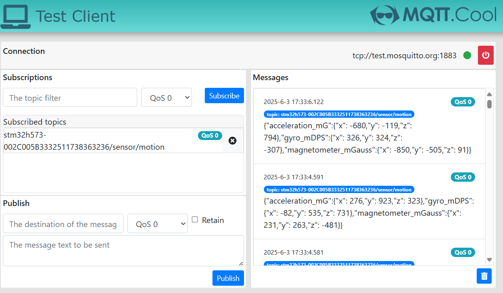
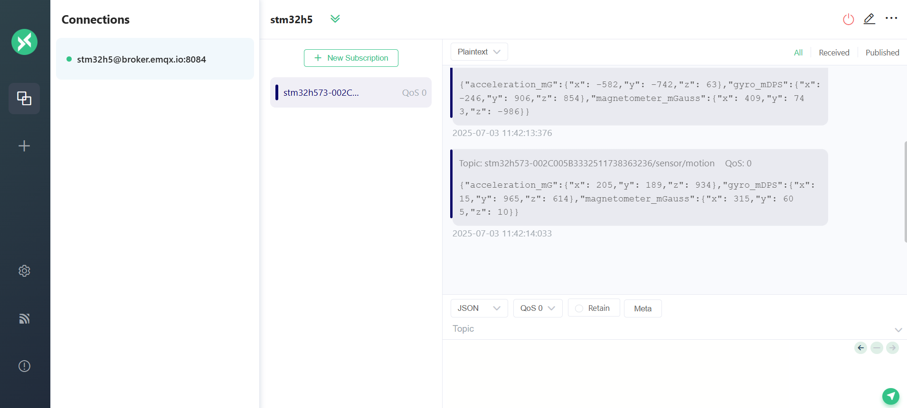

# Motion Sensor Example (`motion_sensor_publish.c`)

This example demonstrates how to publish motion sensor data from the STM32 board to an MQTT broker. The board periodically reads motion sensor values and publishes them in JSON format to a specific MQTT topic.

---

## How It Works

- The firmware reads motion sensor data (e.g., accelerometer, gyroscope, or other motion-related values) at regular intervals.
- The board publishes the sensor readings to the topic:  
  `stm32h573-<device-id>/sensor/motion`  
  in JSON format.

- Example device IDs:
    * Without STSAFE: `stm32h573-002C005B3332511738363236`
    * With STSAFEA-110: `eval3-0102203B825BD42BC20554`
    * With STSAFEA-120: `eval5-0209203D823AD52A920A39`
    * With STSAFEA-TPM: `ST1-TPM-TCA01-ABC60101DD7B33`

---

## MQTT Topic Overview

- **Motion sensor data topic:**  
  `stm32h573-<device-id>/sensor/motion`

#### Example motion sensor data report sent by the board

```json
{
  "acceleration_mG":{
    "x": -543,
    "y": 855,
    "z": 969
  },
  "gyro_mDPS":{
    "x": 649,
    "y": 720,
    "z": -372
  },
  "magnetometer_mGauss":{
    "x": 460,
    "y": -554,
    "z": 609
  }
}
```
>Note: The actual JSON fields and values depend on your sensor and firmware implementation.*

---

## Monitoring MQTT Messages

You can use any MQTT client to monitor the motion sensor data. Below are two recommended web clients:

<details>
  <summary>Option 1: mqtt.cool for test.mosquitto.org</summary>

1. Open [mqtt.cool](https://testclient-cloud.mqtt.cool/)
2. Connect to `test.mosquitto.org` on port `1883`.
3. Subscribe to the topic:  
   `stm32h573-xxxxxxxxxxxxxxxx/sensor/motion`  
   (replace `xxxxxxxxxxxxxxxx` with your board's unique ID, e.g. `stm32h573-002C005B3332511738363236/sensor/motion`)
4. You will see messages published by your board.



</details>

---

<details>
  <summary>Option 2: MQTTX Web Client for broker.emqx.io</summary>

1. Connect to [broker.emqx.io](https://mqttx.app/web-client) on port `8084`.


3. Subscribe to the topic:  
   `stm32h573-xxxxxxxxxxxxxxxx/sensor/motion`  
   (replace `xxxxxxxxxxxxxxxx` with your board's unique ID, e.g. `stm32h573-002C005B3332511738363236/sensor/motion`)
4. You will see messages published by your board.



---

**Note:**  
Replace `xxxxxxxxxxxxxxxx` with your board's unique device ID (Thing Name).

</details>