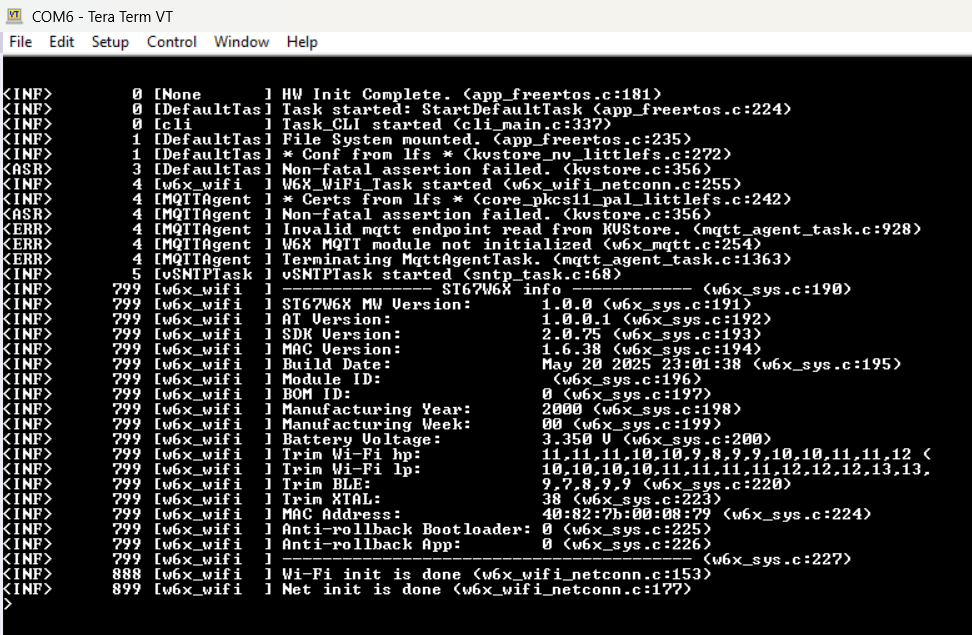
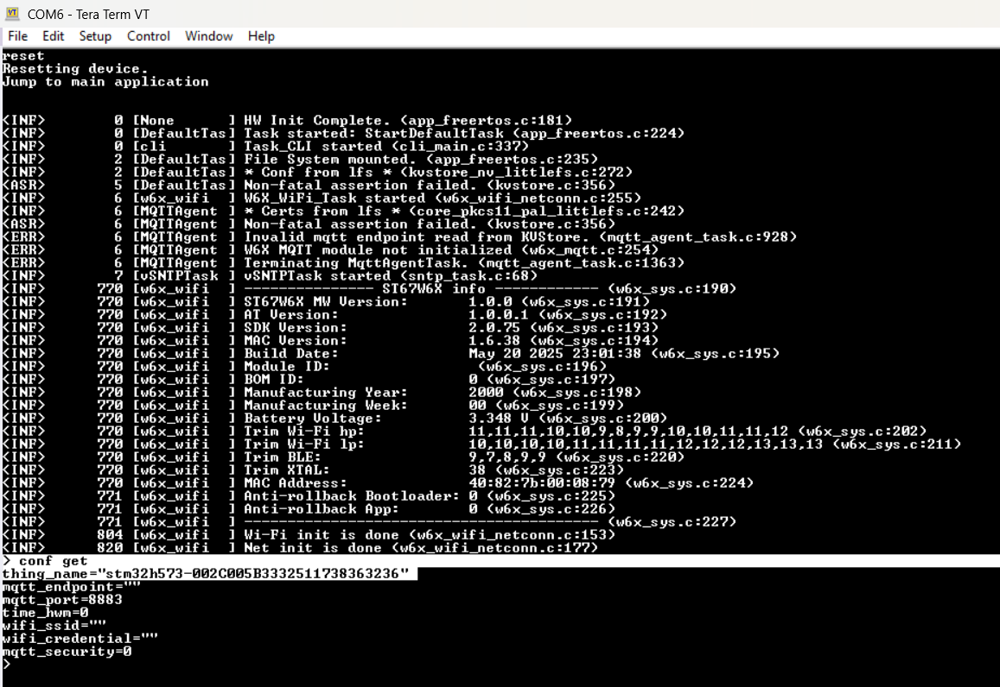
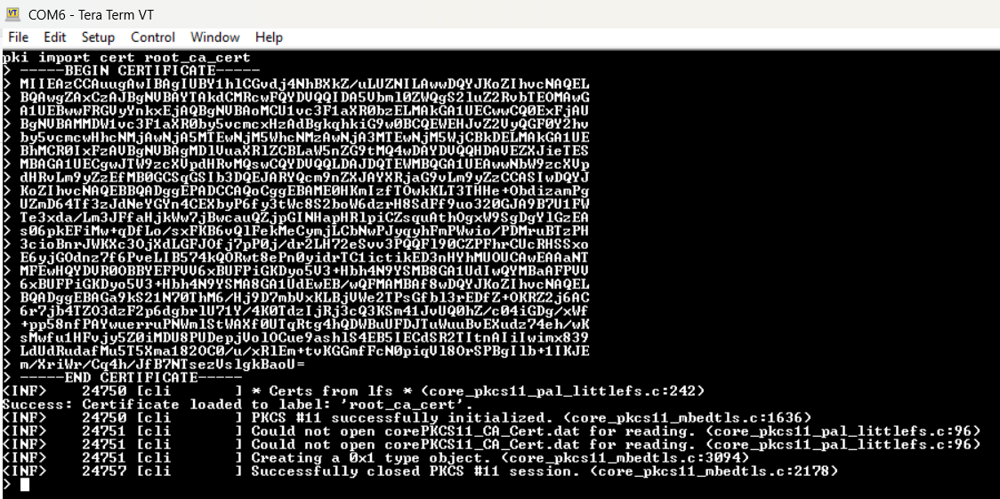
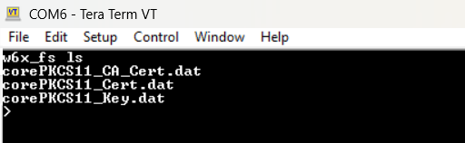
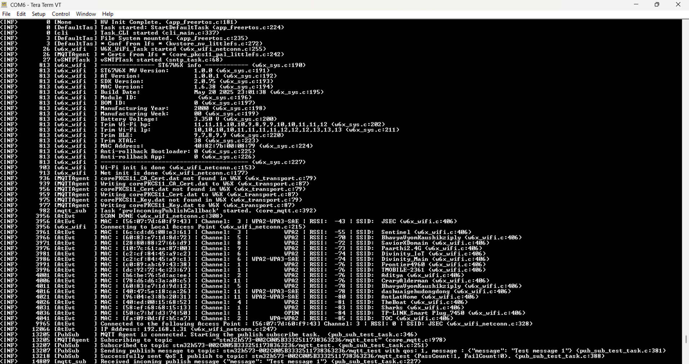

# Provision single device with AWS

[Single Thing Provisioning](https://docs.aws.amazon.com/iot/latest/developerguide/single-thing-provisioning.html), is a method used to provision individual IoT devices in AWS IoT Core. This method is ideal for scenarios where you need to provision devices one at a time.

In this method you have two options: automated using a Python script or manual.  
**This document describes the manual method using the [AWS CLI](./Common/cli/ReadMe.md) runningon STM32**

|       Build Config          | Provisioning method       |
|:---------                   |:----------                |
| Ethernet                    | Single Thing Provisioning |
| MXCHIP                      | Single Thing Provisioning |
| ST67_NCP                    | Single Thing Provisioning |

## 1. Hardware Setup

If you’ve selected the MXCHIP or ST67_NCP configuration, connect the Wi-Fi module to either the STMod+ or Arduino connector on the board.

If you’re using the Ethernet configuration, connect the Ethernet cable to the board’s Ethernet port.

Then, in all cases, connect the board to your PC via the ST-Link USB port to power it and enable programming/debugging.

## 2. Flash and run the project

## 3. Connect with serial terminal

 Open a serial terminal (e.g., Tera Term, PuTTY, [Web based](https://googlechromelabs.github.io/serial-terminal/))  at 115200, 8 bits, 1 stop, no parity

 

## 4. Get the ThingName

Each board automatically generates a unique Thing Name in the format `stm32h573-< DeviceUID >`, where `< DeviceUID >` corresponds to the device's hardware Unique ID (UID). For example: `stm32h573-002C005B3332511738363236`. You can retrieve the Thing Name using the CLI. Save this device ID for further use. You can always retreive it using the `conf get` command

Type the following command on the serial terminal

```
conf get
```


## 5. Generate key pair

Once the command is executed, the system generates an **ECC** key pair using the **MbedTLS** and **PKCS#11** libraries running on the host microcontroller. The key pair is stored in internal Flash via the **LFS** and **PKCS#11** stack. Upon success, the public key is printed to the terminal, confirming the device is ready to generate a **CSR** (Certificate Signing Request) for further provisioning or certificate issuance

Type the following command on the serial terminal

```
pki generate key
```
 

 ## 6. Generate a Certificate

Use the following command in the serial terminal to generate a Certificate:

```
pki generate cert
```

 

This command uses **MbedTLS** and **PKCS#11** running on the host microcontroller to create a self signed certificate from the device’s key pair. The certificate is stored in internal Flash via the **LFS** and **PKCS#11** stack. Upon success, the certificate will be printed in PEM format to the terminal.

copy and save the certificate as **cert.pem**

## 7. Register the Device with AWS IoT Core

Now that you have your device's unique Thing Name and its certificate, follow these steps to register your device in AWS IoT Core:

### a. Open the AWS IoT Console

1. Go to [AWS IoT Core Console](https://console.aws.amazon.com/iot).
2. In the left menu, select **Manage** > **Things**.
3. Click **Create things**.

### b. Create a Single Thing

1. Choose **Create a single thing**.
2. Enter the **Thing Name** you retrieved in step 4 (e.g., `stm32h573-002C005B3332511738363236`).
3. Click **Next**.

### c. Attach the Device Certificate

1. On the "Configure device certificate" page, select **Use my certificate**.
2. For "CA certificate", select **CA is not registered with AWS IoT**.
3. Upload the certificate you saved in step 6 (**cert.pem**).
4. Click **Next**.

### d. Attach a Policy

1. Click **Create a policy**.
2. Name the policy (e.g., `AllowAllDev`).
3. Copy and paste the following policy document:

    ```json
    {
      "Version": "2012-10-17",
      "Statement": [
        {
          "Effect": "Allow",
          "Action": "iot:*",
          "Resource": "*"
        }
      ]
    }
    ```

4. Create the policy and attach it to your Thing.

### e. Finish

1. Review your settings and click **Create thing**.
2. Your device is now registered with AWS IoT Core and ready to connect using the provisioned certificate and Thing Name.

---

## 8. Download the server root CA certificate

Download the AWS root CA certificate:

```sh
wget https://www.amazontrust.com/repository/SFSRootCAG2.pem
```

Or download it manually from [SFSRootCAG2.pem](https://www.amazontrust.com/repository/SFSRootCAG2.pem).
 
## 9. Import the AWS server root CA certificate to STM32

We need to import the AWS server root CA to STM32 so it can be used for TLS authentication.

- On the serial terminal connected to your board, type the following CLI command:

```
pki import cert root_ca_cert
```

- Open the **SFSRootCAG2.pem** file you downloaded in a text editor (such as Notepad, VS Code, or nano).

- Copy the entire contents—be sure to include the lines:  
  `-----BEGIN CERTIFICATE-----  ...your certificate body...  -----END CERTIFICATE-----`

- Then, paste the content into the serial terminal where your board is running and press Enter.

The board will verify the certificate and securely store it in internal Flash using the **MbedTLS**, **PKCS#11**, and **LFS** libraries. If everything is successful, you’ll see a confirmation message in the terminal.



## 10. Set Runtime configuration

- Set the endpoint. You can find your AWS IoT endpoint address in the AWS IoT Console under **Settings** (look for the "Endpoint" value). Type the following command on the serial terminal, replacing `<your-aws-endpoint>` with your actual endpoint:

 ```
conf set mqtt_endpoint <your-aws-endpoint>
```

- Set the MQTT port. Type the following command on the serial terminal

```
conf set mqtt_port 8883
```

- In the case of ST67_NCP or MXCHIP set the Wi-Fi SSID and password. Type the following command on the serial terminal

```
conf set wifi_ssid <YourSSID>
conf set wifi_credential <YourPASSWORD>
```

- In the case of ST67_NCP set the MQTT security. The configuration is required for ST67 to enable TLS mutual authentication. Type the following command on the serial terminal

 ```
conf set mqtt_security 4
```

- Commit the changes. Type the following command on the serial terminal

 ```
conf commit
```


- Use *conf get* command to confirm your configuration
- You can use *conf set <key> <value>* to make any updates
- Use *conf commit* to save configuration updates


## 11. Delete old certs from ST67 internal file system

If you are using the ST67_NCP configuration, it’s important to ensure that all previously stored certificates especially **corePKCS11_CA_Cert.dat**, **corePKCS11_Cert.dat**, and **corePKCS11_Key.dat** are removed from the module’s internal file system before importing new ones. This step is necessary to allow the firmware to load the updated certificates and private key into the ST67 module, which are then used for establishing the TLS/MQTT connection.

- On the serial terminal connected to your board, Type the following command to list all files currently stored in the module:

```
w6x_fs ls
```



- Delete any existing file using the following command:

```
w6x_fs rm <filename>
```


## 12. Reset the board

In the serial terminal connected to your board, type the following command:

```
reset
```

This will reboot the device. Upon startup, the firmware will use the newly imported TLS client certificate and configuration to securely connect to the MQTT broker.

For all standard configurations, the host microcontroller handles the TLS and MQTT stack directly.

For the ST67_NCP configuration, after each boot, the firmware checks for the presence of **corePKCS11_CA_Cert.dat**, **corePKCS11_Cert.dat**, and **corePKCS11_Key.dat** in the ST67's internal file system. If any of these files are missing, the firmware copies the corresponding certificates and private key from the microcontroller's internal file system to ST67.

Once connected, you should see confirmation messages in the terminal indicating a successful TLS handshake and MQTT session establishment.



## 13. Monitor the MQTT messages

You can monitor MQTT messages from your device using the AWS IoT MQTT test client available in the AWS Console.

### Steps:

1. Go to the [AWS IoT Core Console](https://console.aws.amazon.com/iot).
2. In the left menu, select **MQTT test client**.
3. Under **Subscribe to a topic**, enter the topic your device is publishing to (for example, `stm32h573-002C005B3332511738363236/#` or `#` to subscribe to all topics).
4. Click **Subscribe**.

You should now see messages published by your device appear in real time in the test client.


## Run and Test the Examples

After provisioning your board, you can run and test the application features. Refer to the [Run and Test the Examples](readme.md#run-and-test-the-examples) section in the main README for details.

---

[⬅️ Back to Main README - Run and Test the Examples](readme.md#run-and-test-the-examples)