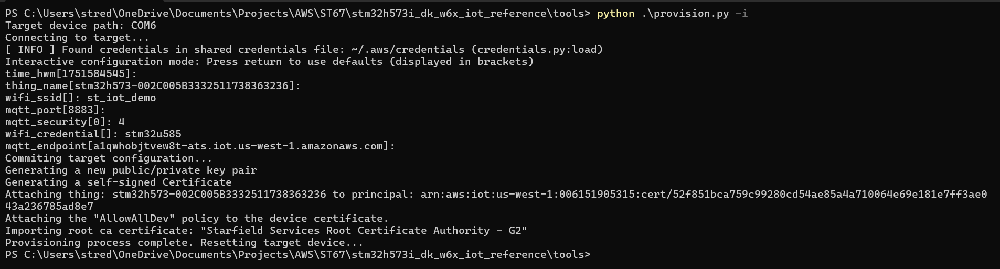

# Provision single device with AWS

[Single Thing Provisioning](https://docs.aws.amazon.com/iot/latest/developerguide/single-thing-provisioning.html), is a method used to provision individual IoT devices in AWS IoT Core. This method is ideal for scenarios where you need to provision devices one at a time.

In this method you have two options: automated using a Python script or manual.  
**This document describes the automated method using the `provision.py` script.**

|       Build Config          | Provisioning method       |
|:---------                   |:----------                |
| Ethernet                    | Single Thing Provisioning |
| MXCHIP                      | Single Thing Provisioning |
| ST67_NCP                    | Single Thing Provisioning |

## 1. Hardware Setup

If you’ve selected the MXCHIP or ST67_NCP configuration, connect the Wi-Fi module to either the STMod+ or Arduino connector on the board.

If you’re using the Ethernet configuration, connect the Ethernet cable to the board’s Ethernet port.

Then, in all cases, connect the board to your PC via the ST-Link USB port to power it and enable programming/debugging.

## 2. Flash and run the project


## 3. Provision Automatically with provision.py

Before you begin, complete the following prerequisites:

### Prerequisites

1. **Create an IAM User in AWS**
   - Go to the [AWS IAM Console](https://console.aws.amazon.com/iam/).
   - Create a new IAM user with programmatic access.
   - Attach the `AWSIoTFullAccess` policy (or equivalent permissions for IoT provisioning).
   - Save the Access Key ID and Secret Access Key.

2. **Install the AWS CLI**
   - Download and install the AWS CLI from [here](https://docs.aws.amazon.com/cli/latest/userguide/getting-started-install.html).

3. **Configure the AWS CLI**
   - Open a terminal and run:
     ```
     aws configure
     ```
   - Enter your Access Key ID, Secret Access Key, default region, and output format when prompted.

---

### Automated Provisioning with provision.py

This method uses the `provision.py` script (included in this pack under the `tools` directory) to automate the onboarding process of IoT devices to AWS IoT Core. The script handles device identity creation, registration, and policy attachment automatically.

#### Steps

1. **Navigate to the tools directory**

     ```
     cd tools
     ```

2. **Install Python Requirements**

   - Install required Python packages:
     ```
     pip install -r requirements.txt
     ```
3. **Locate the Script**
   - The `provision.py` script is available in the `tools` directory of this repository.

4. **Connect your board**
   - Make sure that your board is connected to the PC via the ST-Link USB port and you don't have any serial termian connected to it

5. **Run the Provisioning Script**
   - Open a terminal in the `tools` directory.
   - Run the script in interactive mode
     ```
     python provision.py -i
     ```    
The script will first:

- Prompt you for several configuration options:
  - `time_hwm`
  - `thing_name`
  - `wifi_ssid`
  - `mqtt_port`
  - `mqtt_security`
  - `wifi_credential`
  - `mqtt_endpoint`

**Recommended settings:**
- Accept the default values for `mqtt_endpoint`, `time_hwm`, `thing_name`, and `mqtt_port`.
- For the **ST67_NCP** project, set `mqtt_security` to `4`.
- For **MXCHIP** and **ST67_NCP**, set your `wifi_ssid` and `wifi_credential` as needed.

After answering these prompts, the script will continue automatically to:

- Generate a key pair on the device.
- Generate a certificate on the device.
- Create and register a Thing in AWS IoT Core with the generated certificate.
- Attach the specified policy.
- Import the AWS root CA.

 

For more details and advanced options, see the [official documentation](https://github.com/FreeRTOS/iot-reference-stm32u5/blob/main/Getting_Started_Guide.md#option-8a-provision-automatically-with-provisionpy).

## Delete old certs from ST67 internal file system

If you are using the ST67_NCP configuration, it’s important to ensure that all previously stored certificates especially **corePKCS11_CA_Cert.dat**, **corePKCS11_Cert.dat**, and **corePKCS11_Key.dat** are removed from the module’s internal file system before importing new ones. This step is necessary to allow the firmware to load the updated certificates and private key into the ST67 module, which are then used for establishing the TLS/MQTT connection.

On the serial terminal connected to your board, Type the following command to list all files currently stored in the module:

```
w6x_fs ls
```


Delete any existing file using the following command:
```
w6x_fs rm <filename>
```


**Reset the board**

In the serial terminal connected to your board, type the following command:

```
reset
```

This will reboot the device. Upon startup, the firmware will use the newly imported TLS client certificate and configuration to securely connect to the MQTT broker.

For all standard configurations, the host microcontroller handles the TLS and MQTT stack directly.

For the ST67_NCP configuration, after each boot, the firmware checks for the presence of **corePKCS11_CA_Cert.dat**, **corePKCS11_Cert.dat**, and **corePKCS11_Key.dat** in the ST67's internal file system. If any of these files are missing, the firmware copies the corresponding certificates and private key from the microcontroller's internal file system to ST67.

Once connected, you should see confirmation messages in the terminal indicating a successful TLS handshake and MQTT session establishment.


## Run and Test the Examples

After provisioning your board, you can run and test the application features. Refer to the [Run and Test the Examples](readme.md#7-run-and-test-the-examples) section in the main README for details.

---

[⬅️ Back to Main README - Run and Test the Examples](readme.md#7-run-and-test-the-examples)