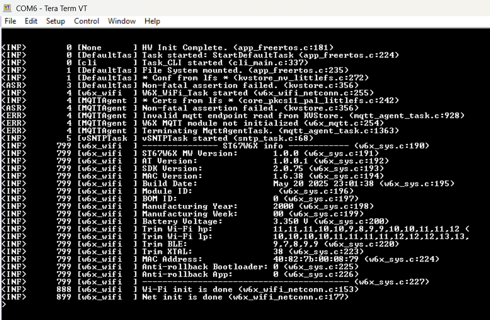
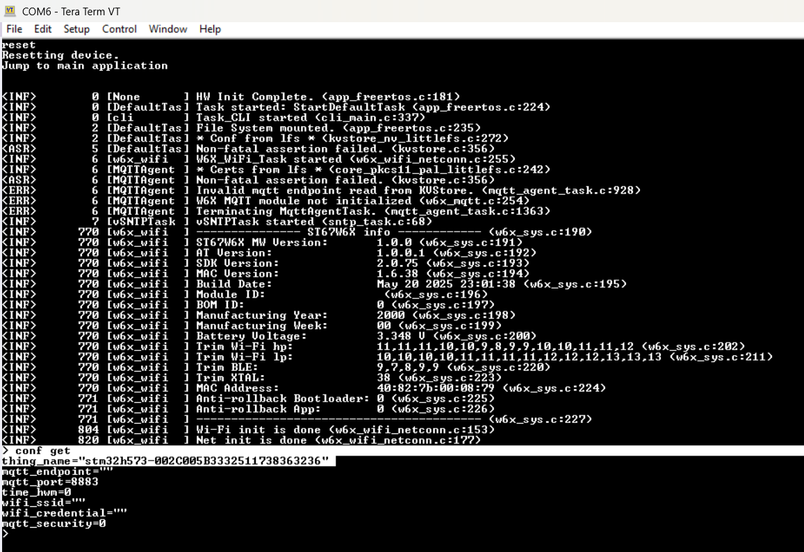
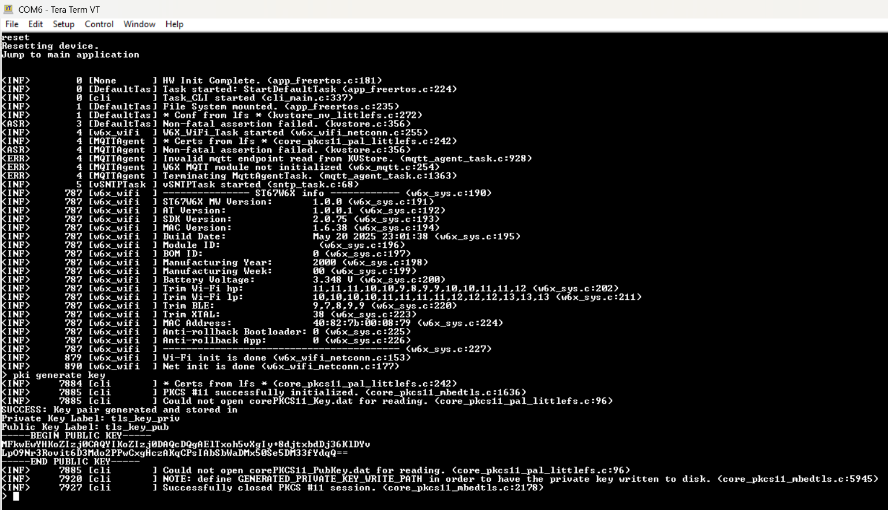
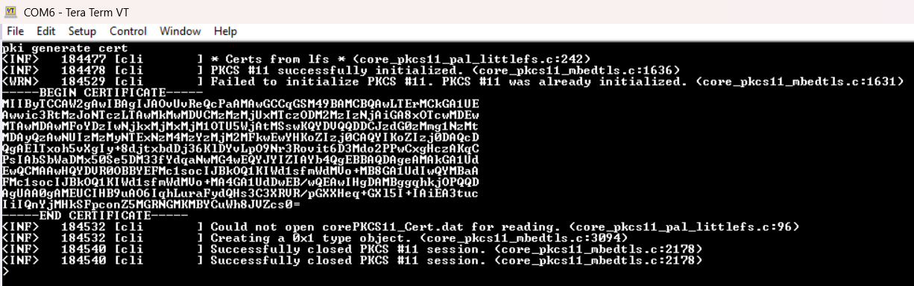
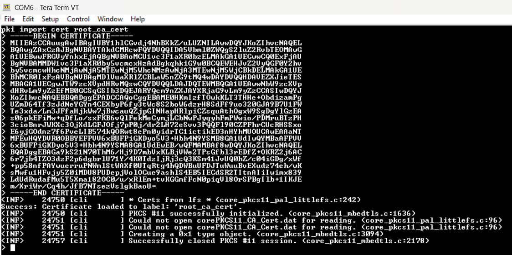
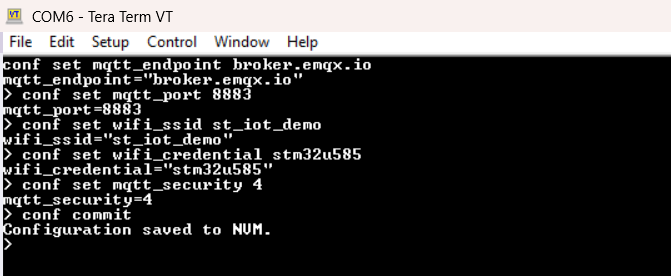
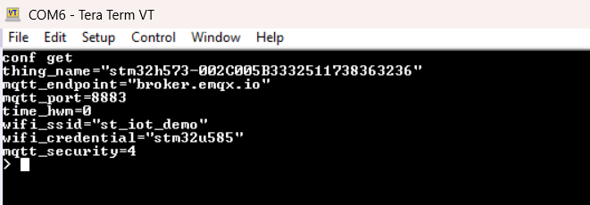
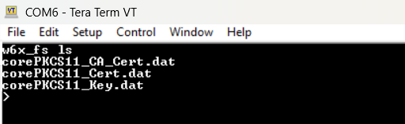
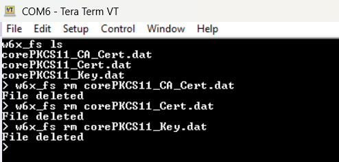
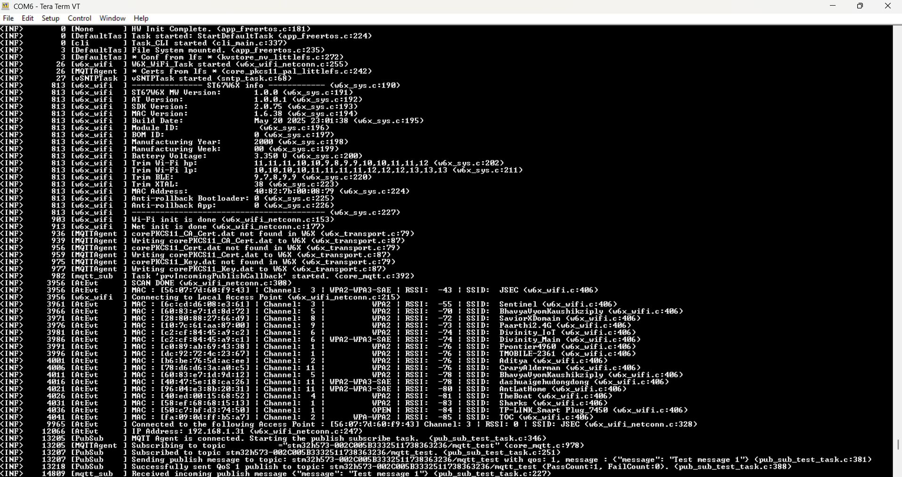

# Provision with EMQX MQTT Broker

The following build configurations support secure communication with [broker.emqx.io](https://www.emqx.com/en/mqtt/public-mqtt5-broker):

> Due to MbedTLS version, Only the ST67_NCP supports connectionnto [broker.emqx.io](https://www.emqx.com/en/mqtt/public-mqtt5-broker). (MXCHIP and Ethernet coonfiguration use newer MbedTLS version)

|       Build Config          | Connects to emqx       |
|:---------                   |:-------                |
| ST67_NCP                    |           Yes          |


## 1. Hardware Setup

Connect the Wi-Fi module to the Arduino connector on the board. Connect the board to your PC via the ST-Link USB port to power it and enable programming/debugging.

## 2. Flash and run the project

## 3. Connect with serial terminal

 Open a serial terminal (e.g., Tera Term, PuTTY, [Web based](https://googlechromelabs.github.io/serial-terminal/))  at 115200, 8 bits, 1 stop, no parity

 

## 4. Get the ThingName

Each board automatically generates a unique Thing Name in the format `stm32h573-< DeviceUID >`, where `< DeviceUID >` corresponds to the device's hardware Unique ID (UID). For example: `stm32h573-002C005B3332511738363236`. You can retrieve the Thing Name using the CLI. Save this device ID for further use. You can always retreive it using the `conf get` command

Type the following command on the serial terminal

```
conf get
```


## 5. Generate key pair

Once the command is executed, the system generates an **ECC** key pair using the **MbedTLS** and **PKCS#11** libraries running on the host microcontroller. The key pair is stored in internal Flash via the **LFS** and **PKCS#11** stack. Upon success, the public key is printed to the terminal, confirming the device is ready to generate a **CSR** (Certificate Signing Request) for further provisioning or certificate issuance

Type the following command on the serial terminal

```
pki generate key
```

 
 
## 6. Generate a Certificate

Use the following command in the serial terminal to generate a Certificate:

```
pki generate cert
```

 


This command uses **MbedTLS** and **PKCS#11** running on the host microcontroller to create a self signed certificate from the device’s key pair. The certificate is stored in internal Flash via the **LFS** and **PKCS#11** stack. Upon success, the certificate will be printed in PEM format to the terminal.

You do not need to save the certificate

## 7. Download the server root CA certificate

Download the EMQX test server's root CA certificate:

```sh
wget https://assets.emqx.com/data/broker.emqx.io-ca.crt
```

Or download it manually from [broker.emqx.io-ca.crt](https://assets.emqx.com/data/broker.emqx.io-ca.crt).
 
## 8. Import the serve root CA certificate to STM32

We need to import the server root CA to STM32 so it can be used with the TLS autentication

- On the serial terminal connected to your board, type the following CLI command:

```
pki import cert root_ca_cert
```

- Open the **broker.emqx.io-ca.crt** file you downloaded in a text editor (such as Notepad, VS Code, or nano). 

- Copy the entire contents—be sure to include the lines: > `-----BEGIN CERTIFICATE-----  ...your certificate body...  -----END CERTIFICATE-----` >

- Then, paste the content into the serial terminal where your board is running and press Enter.

The board will verify the certificate and securely store it in internal Flash using the **MbedTLS**, **PKCS#11**, and **LFS** libraries. If everything is successful, you’ll see a confirmation message in the terminal.



## 9. Set Runtime configuration

- Set the endpoint. Type the following command on the serial terminal

```
conf set mqtt_endpoint broker.emqx.io
```

- Set the MQTT port. Type the following command on the serial terminal

```
conf set mqtt_port 8883
```

- Set the Wi-Fi SSID and password. Type the following command on the serial terminal

```
conf set wifi_ssid < YourSSID >
conf set wifi_credential < YourPASSWORD>
```

- Set the MQTT security

The configuration is required for ST67 enable TLS mutual autentication 

Type the following command on the serial terminal

 ```
conf set mqtt_security 4
```

- Commite the changes. Type the following command on the serial terminal

 ```
conf commit
```



- Use *conf get* command to confirm your configuration
- you can use *conf set < key > < value >* to make any updates
- Use *conf commit* to save configuration updates



## 10. Delete old certs from ST67 internal file system

It is important to ensure that all previously stored certificates especially **corePKCS11_CA_Cert.dat**, **corePKCS11_Cert.dat**, and **corePKCS11_Key.dat** are removed from the module’s internal file system before importing new ones. This step is necessary to allow the firmware to load the updated certificates and private key into the ST67 module, which are then used for establishing the TLS/MQTT connection.

- On the serial terminal connected to your board, Type the following command to list all files currently stored in the module:

```
w6x_fs ls
```



- Delete any existing file using the following command:

```
w6x_fs rm <filename>
```



## 11.Reset the board

In the serial terminal connected to your board, type the following command:

```
reset
```

This will reboot the device. Upon startup, the firmware will use the newly imported TLS client certificate and configuration to securely connect to the MQTT broker.

After each boot, the firmware checks for the presence of **corePKCS11_CA_Cert.dat**, **corePKCS11_Cert.dat**, and **corePKCS11_Key.dat** in the ST67's internal file system. If any of these files are missing, the firmware copies the corresponding certificates and private key from the microcontroller's internal file system to ST67.

Once connected, you should see confirmation messages in the terminal indicating a successful TLS handshake and MQTT session establishment.



## Run and Test the Examples

After provisioning your board, you can run and test the application features. Refer to the [Run and Test the Examples](readme.md#7-run-and-test-the-examples) section in the main README for details.

---

[⬅️ Back to Main README - Run and Test the Examples](readme.md#7-run-and-test-the-examples)