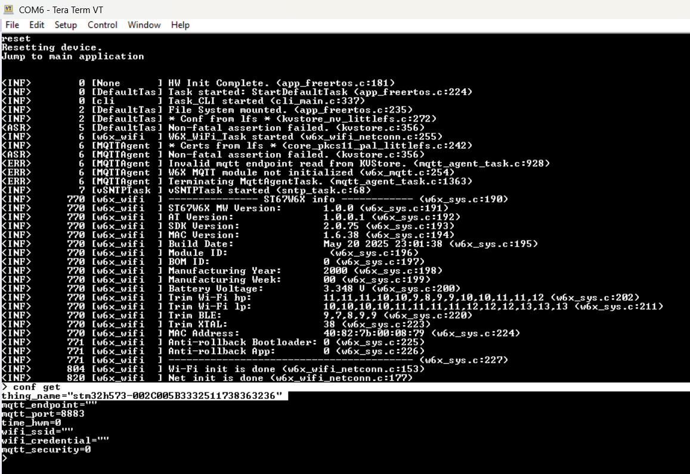
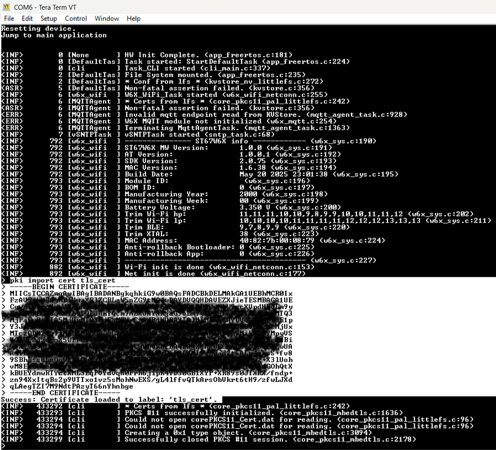
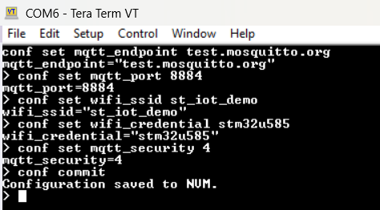
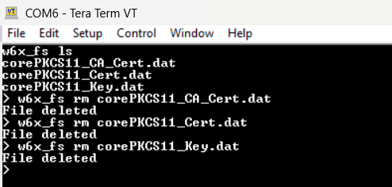

# Provision with Mosquitto

The following build configurations support secure communication with test.mosquitto.org:


|       Build Config          | Connects to Mosquitto  |
|:---------                   |:-------                |
| Ethernet                    |           Yes          |
| MXCHIP                      |           Yes          |
| ST67_NCP                    |           Yes          |


## 1. Hardware Setup

If you’ve selected the MXCHIP or ST67_NCP configuration, connect the Wi-Fi module to either the STMod+ or Arduino connector on the board.

If you’re using the Ethernet configuration, connect the Ethernet cable to the board’s Ethernet port.

Then, in all cases, connect the board to your PC via the ST-Link USB port to power it and enable programming/debugging.

## 2. Flash and run the project

## 3. Connect with serial terminal

 Open a serial terminal (e.g., Tera Term, PuTTY, [Web based](https://googlechromelabs.github.io/serial-terminal/))  at 115200, 8 bits, 1 stop, no parity

 

## 4. Get the ThingName

Each board automatically generates a unique Thing Name in the format `stm32h573-< DeviceUID >`, where `< DeviceUID >` corresponds to the device's hardware Unique ID (UID). For example: `stm32h573-002C005B3332511738363236`. You can retrieve the Thing Name using the CLI. Save this device ID for further use. You can always retreive it using the `conf get` command

Type the following command on the serial terminal

```
conf get
```


## 5. Generate key pair

Once the command is executed, the system generates an **ECC** key pair using the **MbedTLS** and **PKCS#11** libraries running on the host microcontroller. The key pair is stored in internal Flash via the **LFS** and **PKCS#11** stack. Upon success, the public key is printed to the terminal, confirming the device is ready to generate a **CSR** (Certificate Signing Request) for further provisioning or certificate issuance

Type the following command on the serial terminal

```
pki generate key
```

 
 
## 6. Generate Certificate Signing Request (CSR)

Use the following command in the serial terminal to generate a Certificate Signing Request (CSR):

```
pki generate csr
```

This command uses **MbedTLS** and **PKCS#11** running on the host microcontroller to create the CSR from the device’s key pair. The CSR will be printed in PEM format to the terminal.

The generated CSR is required to obtain a client certificate from [test.mosquitto.org](test.mosquitto.org), enabling the device to securely authenticate and connect to the Mosquitto MQTT broker using mutual TLS.

## 7. Generate Client Certificate

- Copy the entire CSR (including the `-----BEGIN CERTIFICATE REQUEST----- and -----END CERTIFICATE REQUEST-----` lines) from the terminal output.

- Visit [test.mosquitto.org’s](https://test.mosquitto.org/ssl/) CSR page.

- Paste the CSR into the designated text area.

- Click Submit.

Your client certificate will be generated and automatically downloaded by your browser (typically saved as **client.crt** in your Downloads folder).

If prompted with a browser security warning, accept it to complete the download.

> Certificates generated by test.mosquitto.org are valid for 90 days.

## 8. Import the TLS client cert

After downloading the **client.crt** file from test.mosquitto.org, you’ll need to import it to your board using the serial terminal.

- On the serial terminal connected to your board, Type the following CLI command:

```
pki import cert tls_cert
```

- Open the **client.crt** file you downloaded in a text editor (such as Notepad, VS Code, or nano). Copy the entire contents—be sure to include the lines: > `-----BEGIN CERTIFICATE-----  ...your certificate body...  -----END CERTIFICATE-----`  > Then, paste the content into the serial terminal where your board is running and press Enter.

The board will verify the certificate and securely store it in internal Flash using the MbedTLS, PKCS#11, and LFS libraries. If everything is successful, you’ll see a confirmation message in the terminal.



## 9. Download the server root CA certificate

Download the Mosquitto test server's root CA certificate:

```sh
wget https://test.mosquitto.org/ssl/mosquitto.org.crt
```

Or download it manually from [https://test.mosquitto.org/ssl/mosquitto.org.crt](https://test.mosquitto.org/ssl/mosquitto.org.crt).
 


## 10. Import the server root CA certificate

We need to import the server root CA to STM32 so it can be used with the TLS autentication

- On the serial terminal connected to your board, type the following CLI command:

```
pki import cert root_ca_cert
```

-  Open the **mosquitto.org.crt** file you downloaded in a text editor (such as Notepad, VS Code, or nano).

- Copy the entire contents—be sure to include the lines: > `-----BEGIN CERTIFICATE----- > ...your certificate body... -----END CERTIFICATE-----` > 

- Then, paste the content into the serial terminal where your board is running and press Enter.

The board will verify the certificate and securely store it in internal Flash using the **MbedTLS**, **PKCS#11**, and **LFS** libraries. If everything is successful, you’ll see a confirmation message in the terminal.


## 11. Set Runtime configuration

- Set the endpoint. Type the following command on the serial terminal

 ```
conf set mqtt_endpoint test.mosquitto.org
```

- Set the MQTT port. Type the following command on the serial terminal

```
conf set mqtt_port 8884
```

- In the case of ST67_NCP or MXCHIP set the Wi-Fi SSID and password. Type the following command on the serial terminal

```
conf set wifi_ssid < YourSSID >
conf set wifi_credential < YourPASSWORD>
```

- In the case of ST67_NCP set the MQTT security. Type the following command on the serial terminal

The configuration is required for ST67 enable TLS mutual autentication 

Type the following command on the serial terminal

 ```
conf set mqtt_security 4
```

- Commite the changes. Type the following command on the serial terminal

 ```
conf commit
```



- Use *conf get* command to confirm your configuration
- you can use *conf set < key > < value >* to make any updates
- Use *conf commit* to save configuration updates


## 12. Delete old certs from ST67 internal file system

If you are using the ST67_NCP configuration, it’s important to ensure that all previously stored certificates especially **corePKCS11_CA_Cert.dat**, **corePKCS11_Cert.dat**, and **corePKCS11_Key.dat** are removed from the module’s internal file system before importing new ones. This step is necessary to allow the firmware to load the updated certificates and private key into the ST67 module, which are then used for establishing the TLS/MQTT connection.

- On the serial terminal connected to your board, Type the following command to list all files currently stored in the module:

```
w6x_fs ls
```


- Delete any existing file using the following command:

```
w6x_fs rm <filename>
```



## 13. Reset the board

In the serial terminal connected to your board, type the following command:

```
reset
```

This will reboot the device. Upon startup, the firmware will use the newly imported TLS client certificate and configuration to securely connect to the MQTT broker.

For all standard configurations, the host microcontroller handles the TLS and MQTT stack directly.

For the ST67_NCP configuration, after each boot, the firmware checks for the presence of **corePKCS11_CA_Cert.dat**, **corePKCS11_Cert.dat**, and **corePKCS11_Key.dat** in the ST67's internal file system. If any of these files are missing, the firmware copies the corresponding certificates and private key from the microcontroller's internal file system to ST67.

Once connected, you should see confirmation messages in the terminal indicating a successful TLS handshake and MQTT session establishment.


## Run and Test the Examples

After provisioning your board, you can run and test the application features. Refer to the [Run and Test the Examples](readme.md#run-and-test-the-examples) section in the main README for details.

---

[⬅️ Back to Main README - Run and Test the Examples](readme.md#run-and-test-the-examples)