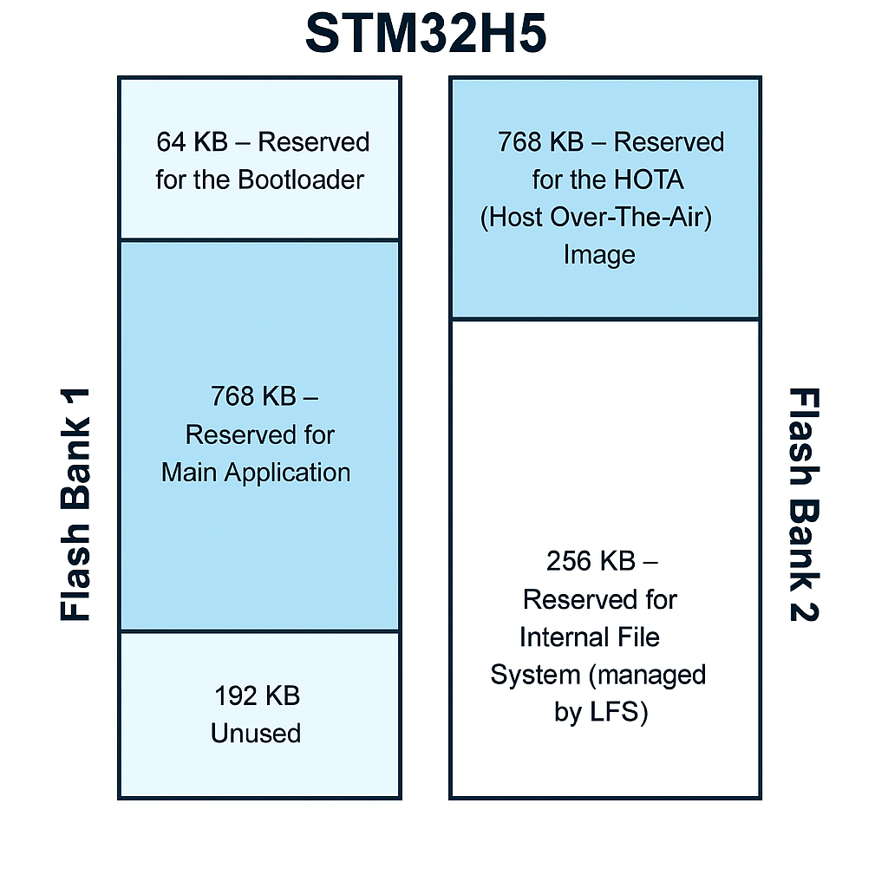
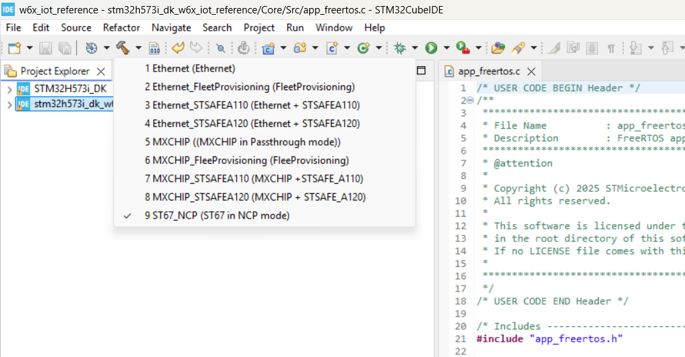

# STM32H573I-DK FreeRTOS IoT Reference
## 1. Introduction
This project demonstrates how to integrate modular [FreeRTOS kernel and libraries](https://www.freertos.org/Documentation/03-Libraries/01-Library-overview/03-LTS-libraries/01-LTS-libraries), [LwIP](https://savannah.nongnu.org/projects/lwip/) and [MbedTLS](https://github.com/Mbed-TLS/mbedtls) to enable secure, connected IoT applications. It offers nine flexible configurations, making it adaptable for a variety of hardware setups and application needs. It is pre-configured to run on the [ STM32H573I-DK ](https://www.st.com/en/evaluation-tools/stm32h573i-dk.html) using Ethernet, [X-NUCLEO-67W61M1](https://www.st.com/en/evaluation-tools/x-nucleo-67w61m1.html) Wi-Fi  and MXCHIP EMW3080B Wi-Fi.

The project supports TLS authentication with or without the [STSAFE](https://www.st.com/resource/en/brochure/stsafe-brochure.pdf) secure element, providing both enhanced hardware-based credential protection and a fallback software-based implementation for systems without secure elements. Both [STSAFEA110](https://www.st.com/en/secure-mcus/stsafe-a110.html) and [STSAFEA120](https://www.st.com/en/secure-mcus/stsafe-a120.html) are supprted.

Secure MQTT connectivity is supported, with working examples provided for [AWS IoT Core](https://aws.amazon.com/), [test.mosquitto.org](https://test.mosquitto.org/) and [broker.emqx.io](https://www.emqx.com/en/mqtt/public-mqtt5-broker).

- The application connects to an MQTT broker and showcases the following demonstration tasks:


- The following features are **only available when connected to Mosquitto or EMQX**:
  * LED control (On, Off)
  * Button status (On, Off)
  * Home Assistant discovery configuration

- The following features are only available when connected to **AWS IoT Core**

  * [AWS IoT Fleet Provisioning](https://docs.aws.amazon.com/iot/latest/developerguide/provision-wo-cert.html)
  * [AWS IoT Device Shadow](https://docs.aws.amazon.com/iot/latest/developerguide/iot-device-shadows.html) - LED control (On, Off)
  * [AWS IoT OTA Update](https://docs.aws.amazon.com/freertos/latest/userguide/freertos-ota-dev.html)
  * [AWS IoT Jobs](https://docs.aws.amazon.com/iot/latest/developerguide/iot-jobs.html)
  * [MQTT File Delivery](https://docs.aws.amazon.com/iot/latest/developerguide/mqtt-based-file-delivery.html)

- The following features are available for all connections
  * Publish and Subscribe
  * Env Sensor
  * Motion sensor

To simplify large-scale deployments, the project supports AWS IoT [Fleet Provisioning](https://docs.aws.amazon.com/iot/latest/developerguide/provision-wo-cert.html#claim-based) via Claim-based registration, [Multi-Account Registration](https://aws.amazon.com/about-aws/whats-new/2020/04/simplify-iot-device-registration-and-easily-move-devices-between-aws-accounts-with-aws-iot-core-multi-account-registration/), [Just-in-Time Provisioning (JITP)](https://aws.amazon.com/blogs/iot/setting-up-just-in-time-provisioning-with-aws-iot-core/) or [Just-in-Time Registration](https://aws.amazon.com/blogs/iot/just-in-time-registration-of-device-certificates-on-aws-iot/) allowing devices to be automatically onboarded and securely authenticated with AWS IoT Core. This streamlines the setup and management of large fleets of devices, saving time and reducing manual configuration effort.

## 2. Flexible and Portable Security Architecture

The project supports connections to [AWS IoT Core](https://aws.amazon.com/), [test.mosquitto.org](https://test.mosquitto.org/) and [broker.emqx.io](https://www.emqx.com/en/mqtt/public-mqtt5-broker). In all cases, [X.509 certificates](https://en.wikipedia.org/wiki/X.509) are required for device/server authentication, ensuring secure and trusted communication with the MQTT broker

This project provides nine (9) build configurations to support a variety of hardware platforms and secure connectivity methods. MXCHIP, ST67_NCP, and Ethernet configurations offer flexibility by supporting wireless or wired connections. The remaining configurations FleetProvisioning, [STSAFEA110](https://www.st.com/en/secure-mcus/stsafe-a110.html), and [STSAFEA120](https://www.st.com/en/secure-mcus/stsafe-a120.html) variants for both Ethernet and MXCHIP are tailored specifically for [AWS IoT Core](https://aws.amazon.com/), utilizing features such as Just-In-Time Provisioning and hardware-based secure elements to enable secure device onboarding. 

In most configurations, the TLS and MQTT stacks run on the host microcontroller. However, in the ST67_NCP configuration, TLS and MQTT communication are offloaded to the ST67 Wi-Fi module.

In the case of [STSAFEA110](https://www.st.com/en/secure-mcus/stsafe-a110.html), and [STSAFEA120](https://www.st.com/en/secure-mcus/stsafe-a120.html) configurations, all sensitive assets—including the TLS private key, device certificate, broker root CA and device configuration parameters (e.g., MQTT endpoint, port, Wi-Fi credentials)—are securely stored within the non-volatile memory of the STSAFE-A secure element.

To further strengthen system resilience, cryptographic operations utilize the hardware-based Random Number Generator (RNG) embedded within the STSAFE device, rather than relying on the STM32's internal RNG. The STSAFE RNG is designed to meet stringent security standards (such as NIST SP 800-90A/B/C) and generates high-entropy randomness ideally suited for secure key generation, session establishment, and cryptographic protocols. This minimizes the risk of predictability or bias in entropy sources—critical in TLS handshakes and other secure interactions.

Additionally, encrypted I²C communication between the host MCU and STSAFE can be enabled, ensuring confidentiality and integrity of sensitive exchanges, even on potentially untrusted system buses.

By offloading both credential storage and secure random number generation to STSAFE, the system significantly reduces attack surface and aligns with modern security best practices rooted in hardware isolation.

Whether credentials and configuration are stored in internal Flash or inside a secure element (STSAFE-A110/A120), the application always accesses them through standardized interfaces, providing a consistent and secure abstraction layer across all configurations.

- PKCS#11 is used for cryptographic assets like TLS keys and certificates

- KVS (Key-Value Storage) is used for runtime parameters such as the MQTT endpoint, port, and Wi-Fi credentials

This abstraction enables code portability across hardware configurations and promotes secure, modular design without requiring changes in application logic.

 - STSAFE-A Secure Element Zone Mapping

| Purpose                    | STSAFEA110 | STSAFEA120 |
|----------------------------|------------|------------|
| Device Certificate         | Zone 0     | Zone 0     |
| KV Store (Configuration)   | Zone 1     | Zone 1     |
| Code Signing Key           | Zone 2     | Zone 2     |
| Server CA Certificate      | Zone 4     | Zone 11    |

The STSAFE mapping is configured in *stsafe.h* and *stsafe.c* files

## 3. Key Software Components
### Mbedtls 3.1.1 TLS and Cryptography library
See [ MbedTLS ](https://www.keil.arm.com/packs/mbedtls-arm/versions/) for details.

### Command Line Interface (CLI)
The CLI interface located in the project/Common/directory is used to provision the device. It also provides other Unix-like utilities. See [Common/cli](project/Common/cli/ReadMe.md) for details.

### Key-Value Store (KVS)
The key-value store located in the Common/kvstore directory is used to store runtime configuration values in STM32's internal flash memory or in STSAFE depending on the selected project configuration.
See [Common/kvstore](project/Common/kvstore/ReadMe.md) for details.

### PkiObject API

The PkiObject API takes care of some of the mundane tasks in converting between different representations of cryptographic objects such as public keys, private keys, and certificates. See [Common/crypto](project/Common/crypto/ReadMe.md) for details.

### PKCS#11
The PKCS11 API is used to handle keys and certificates, whether they are stored in internal Flash or within the STSAFE secure element. See [corePKCS11 Library](https://github.com/FreeRTOS/corePKCS11/blob/main/README.md) for details.

                          ┌────────────────────────────┐
                          │   Application Layer        │
                          │  (TLS, MQTT, Wi-Fi setup)  │
                          └──────┬──────────┬──────────┘
                                 │          │
                            ┌────▼────┐┌────▼────┐
    Manage keys and certs → │ PKCS#11 ││  KVS    │ ← stores runtime config like endpoints & Wi-Fi
                            └────┬────┘└────┬────┘
                                 │          │
                                 │          │
                          ┌──────▼──────────▼───────┐
                          │ Storage Backend Layer   │
                          ├─────────────────────────┤
                          │ Internal Flash (lfs)    │
                          │        OR               │
                          │ STSAFE-A (A110/A120)    │ ← secure storage & cryptographic engine
                          └─────────────────────────┘

>In STSAFE configurations, all certificates, keys, and runtime settings are stored in STSAFE. In other cases, they reside in the STM32’s internal Flash.

>In ST67_NCP configuration, certificates and keys are transferred from STM32's internal Flash to ST67’s internal file system, and TLS/MQTT connection is managed by ST67. Otherwise, TLS/MQTT runs on the host processor.

## 4 Flash Memory Layout

The STM32H5 features a dual-bank flash architecture. In this project, each bank is assigned a specific role to support firmware updates, runtime storage, and persistent configuration:

**Flash Bank 1**

64 KB — Reserved for the Bootloader.

768 KB — Reserved for the Main Applications.

192 — Unused. We need to maintain same size for application and HOTA sections.

**Flash Bank 2**

768 KB — Reserved for the HOTA (Host Over-The-Air) Image.

256 KB — Reserved for the internal file system, managed by the LFS (LittleFS) library. This space is used to store certificates, keys, and runtime configuration data in configurations that do not use STSAFE.



**Bootloader Responsibilities**

Installs new firmware updates stored in the HOTA region (Flash Bank 2) by copying them to the Application region in Flash Bank 1

Performs a jump to the main application stored in Flash Bank 1 after validation

>**Note:** HOTA is available only when connected to AWS

---
> ⚠️ **SECURITY WARNING:**  
> The provided bootloader is for **demonstration purpose only** and does **not** include built-in security features.  
> **You must perform a thorough security audit and select or develop a bootloader that aligns with the security requirements of your final application** (e.g., image signature verification, anti-rollback protection, secure boot enforcement, device readout protection, JTAG fuse ...).
---

**File system region**
The file system region managed by the LFS library to stores persistent runtime assets such as:

- TLS device private key and certificate

- Server Root CA certificate

- HOTA public key for image verification

- Device configuration (MQTT endpoint, port, Wi-Fi credentials, etc.)

This structure ensures robust firmware update capability while maintaining secure and flexible runtime configuration storage.

## 5. Get started with the project

### Cloning the Repository
To clone using HTTPS:
```
git clone https://github.com/SlimJallouli/stm32h573i_dk_w6x_iot_reference.git --recurse-submodules
```

If you have downloaded the repo without using the `--recurse-submodules` argument, you should run:

```
git submodule update --init --recursive
```

### Update the [X-NUCLEO-67W61M1](https://www.st.com/en/evaluation-tools/x-nucleo-67w61m1.html) module

If you are using the [X-NUCLEO-67W61M1](https://www.st.com/en/evaluation-tools/x-nucleo-67w61m1.html) module, you need to make sure to update the module firmware to revision 1.0.0. Follow this [link](https://github.com/STMicroelectronics/x-cube-st67w61/tree/main/Projects/ST67W6X_Utilities/Binaries) for instructions

### Build the project
* Import the project with [STM32CubeIDE](http://www.st.com/stm32cubeide)
* Select the configuration using the drop-down menu. 
* Build the project
* Flash the board

|       Build Config          | Connects to AWS IoT | Connects to Mosquitto  |Connects to emqx        |OTA       |
|:---------                   |:----------          |:-------                |:-------                |:-------  | 
| Ethernet                    |         Yes         |           Yes          |           No           |    Yes   | 
| Ethernet_FleetProvisioning  |         Yes         |           No           |           No           |    Yes   | 
| Ethernet_STSAFEA110         |         Yes         |           No           |           No           |    Yes   | 
| Ethernet_STSAFEA120         |         Yes         |           No           |           No           |    Yes   | 
| MXCHIP                      |         Yes         |           Yes          |           No           |    Yes   | 
| MXCHIP_FleetProvisioning    |         Yes         |           No           |           No           |    Yes   | 
| MXCHIP_STSAFEA110           |         Yes         |           No           |           No           |    Yes   | 
| MXCHIP_STSAFEA120           |         Yes         |           No           |           No           |    Yes   | 
| ST67_NCP                    |         Yes         |           Yes          |           Yes          |    No    | 

>**Note:** Fleet provisioning, STSAFE and OTA options are available exclusively when connected to AWS.

>**Note:** In STSAFE configurations, all certificates, keys, and runtime settings are stored in STSAFE. In other cases, they reside in the STM32’s internal Flash.

>**Note:** In ST67_NCP configuration, certificates and keys are transferred from STM32's internal Flash to ST67’s internal file system, and TLS/MQTT connection is managed by ST67. Otherwise, TLS/MQTT runs on the host processor.

To view the available build configurations in STM32CubeIDE:

Click the small triangle (disclosure arrow) just to the right of the hammer icon. This will reveal the list of build configurations available for your board. Project build will automatically start after you select the project configuration



## Provision your board

Choose your MQTT broker and provisioning method below. Each link provides step-by-step instructions for provisioning your board and running the example.

---

### 1. Connect to Mosquitto (test.mosquitto.org)
- **Supported Build Configurations:**  
  `Ethernet`, `MXCHIP`, `ST67_NCP`
- **Provisioning Method:**  
  Single Thing Provisioning  
- **Guide:**  
  - [Provision and Run with test.mosquitto.org](provision_mosquitto.md)

---

### 2. Connect to EMQX (broker.emqx.io)
- **Supported Build Configurations:**  
  `ST67_NCP`
- **Provisioning Method:**  
  Single Thing Provisioning  
- **Guide:**  
  - [Provision and Run with EMQX MQTT Broker](provision_emqx.md)

---

### 3. Connect to AWS IoT Core

#### a. Single Thing Provisioning
- **Supported Build Configurations:**  
  `Ethernet`, `MXCHIP`, `ST67_NCP`
- **Guides:**  
  - [Provision and Run with AWS (CLI)](provision_aws_single_cli.md)
  - [Provision and Run with AWS (Script)](provision_aws_single_script.md)

#### b. Fleet Provisioning
- **Supported Build Configurations:**  
  `Ethernet_FleetProvisioning`, `MXCHIP_FleetProvisioning`
- **Guide:**  
  - [Provision and Run with AWS Fleet Provisioning](provision_aws_FleetProvisioning.md)

#### c. Secure Element (STSAFE) Provisioning
- **Supported Build Configurations:**  
  `Ethernet_STSAFEA110`, `Ethernet_STSAFEA120`, `MXCHIP_STSAFEA110`, `MXCHIP_STSAFEA120`
- **Provisioning Methods:**  
  Multi-Account Registration (MAR), Just-in-Time Provisioning (JITP), Just-in-Time Registration (JITR)
- **Guide:**  
  - [Provision and Run with AWS using STSAFE](provision_aws_STSAFE.md)

---

## Run and Test the Examples

After provisioning your board, you can run and test the application features. Refer to the following example guides for details:

- [LED Control Example](project/Common/app/led/readme.md)
- [Button Status Example](project/Common/app/button/readme.md)
- [Home Assistant Discovery Example](project/Common/app/HomeAssistant/home_assistant_discovery.md)
- [Environmental Sensor Example](project/Common/app/sensors/env_sensor_readme.md)
- [Motion Sensor Example](project/Common/app/sensors/motion_sensor_readme.md)
- [AWS Fleet Provisioning](https://github.com/stm32-hotspot/stm32mcu_aws_fleetProvisioning)
- [AWS Defender](redme_aws_defender.md)
- [AWS Shadow](readme_aws_shadow.md)
- [AWS OTA](readme_aws_ota.md)

These guides explain how to interact with your board using MQTT clients, monitor messages, and control or observe peripherals.

---

## 6. Required CMSIS Packs

If you plan to regenerate the project using STM32CubeMX, you must download and install the following CMSIS packs **before opening** the .ioc file. These packs provide essential middleware and AWS IoT functionality.

**Required Packs:**
- [mbedTLS 3.1.1](https://www.keil.com/pack/ARM.mbedTLS.3.1.1.pack)  
- [AWS IoT Over-the-air Update 5.0.1](https://d1pm0k3vkcievw.cloudfront.net/AWS.AWS_IoT_Over-the-air_Update.5.0.1.pack)  
- [AWS IoT Device Defender 4.1.1](https://d1pm0k3vkcievw.cloudfront.net/AWS.AWS_IoT_Device_Defender.4.1.1.pack)  
- [AWS IoT Device Shadow 5.0.1](https://d1pm0k3vkcievw.cloudfront.net/AWS.AWS_IoT_Device_Shadow.5.0.1.pack)  
- [AWS IoT Fleet Provisioning 1.0.1](https://d1pm0k3vkcievw.cloudfront.net/AWS.AWS_IoT_Fleet_Provisioning.1.0.1.pack)  
- [backoffAlgorithm 4.1.1](https://d1pm0k3vkcievw.cloudfront.net/AWS.backoffAlgorithm.4.1.1.pack)  
- [coreJSON 4.1.1](https://d1pm0k3vkcievw.cloudfront.net/AWS.coreJSON.4.1.1.pack)  
- [coreMQTT 5.0.1](https://d1pm0k3vkcievw.cloudfront.net/AWS.coreMQTT.5.0.1.pack)  
- [coreMQTT_Agent 5.0.1](https://d1pm0k3vkcievw.cloudfront.net/AWS.coreMQTT_Agent.5.0.1.pack)  

> **Tip:** Install these packs in STM32CubeIDE via the "Packs Manager" before regenerating or building the project.

---

## 7. Git Submodules

This project uses several external libraries as git submodules. Make sure to initialize and update submodules after cloning:

- [corePKCS11](https://github.com/FreeRTOS/corePKCS11)
- [littlefs](https://github.com/littlefs-project/littlefs)
- [tinycbor](https://github.com/intel/tinycbor)


## 8. Generate the Project Using STM32CubeMX

---

> ⚠️ **VERY IMPORTANT:**  
> **After making any changes with STM32CubeMX and regenerating the project, you _must_ run the `update.sh` script before building.**  
>  
> 🚫 *Failure to run `update.sh` will result in build errors!*

---

