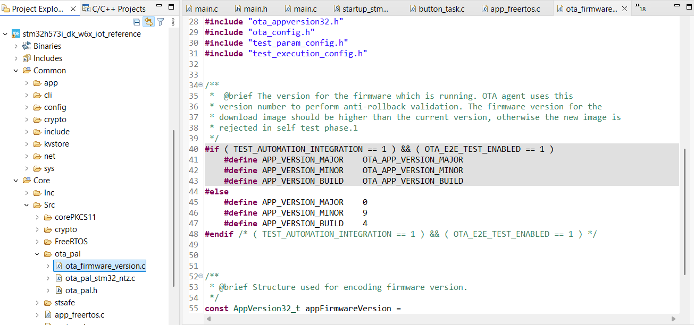

# AWS IoT OTA (Over-the-Air) Update

## What is AWS IoT OTA?

[AWS IoT Over-the-Air (OTA) Update](https://docs.aws.amazon.com/freertos/latest/userguide/freertos-ota-dev.html) is a managed AWS IoT service that allows you to remotely and securely deploy firmware updates to your IoT devices in the field. OTA updates help you keep your devices up to date with new features, security patches, and bug fixes without requiring physical access.

---

## Key Features

- **Remote Firmware Updates:**  
  Deploy new firmware images to one or many devices over the air.

- **Secure Delivery:**  
  Uses code signing and TLS to ensure that only authenticated and verified updates are applied.

- **Scalable:**  
  Manage updates for a single device or entire fleets.

- **Job Management:**  
  Schedule, monitor, and manage update jobs from the AWS IoT Console.

---

## How It Works

1. **Create a firmware image** and upload it to an Amazon S3 bucket.
2. **Create a code signing profile** to sign your firmware image.
3. **Create an OTA update job** in the AWS IoT Console, specifying the target devices (Things or Thing Groups).
4. **Devices receive the job notification** and download the firmware image securely.
5. **Device verifies the signature** and applies the update if valid.
6. **Device reports the update status** (success or failure) back to AWS IoT.

---

## Why Use AWS IoT OTA?

- **Reduce maintenance costs** by updating devices remotely.
- **Improve security** by quickly deploying patches and fixes.
- **Add new features** and improve device functionality after deployment.
- **Monitor update progress** and troubleshoot failures from the cloud.

---

For more information, see the [AWS IoT OTA documentation](https://docs.aws.amazon.com/freertos/latest/userguide/freertos-ota-dev.html).


## How to Create an OTA Update

To perform an OTA update with AWS IoT, follow these steps:

Before proceeding with OTA, **after making any changes to the firmware**, you must update the firmware revision number in your `Core\Src\ota_pal\ota_firmware_version.c` file.  
This ensures that STM32 recognizes the new firmware version and allows the update to proceed.

Refer to the following example and screenshot:

```c
// ota_firmware_version.c
#define APP_VERSION_MAJOR    1
#define APP_VERSION_MINOR    0
#define APP_VERSION_BUILD    2
```

Update the `APP_VERSION_MAJOR`, `APP_VERSION_MINOR`, or `APP_VERSION_BUILD` as needed for each new firmware release.



---

### 1. Create a Code Signing Key Pair and Certificate

AWS IoT OTA requires your firmware images to be signed before deployment.  
- You can use the provided helper scripts to generate a code signing certificate:
    - For Windows: `tools\host-ota-cert\generate_cert.ps1`
    - For Linux: `tools/host-ota-cert/generate_cert.sh`
- Before running the script, update the following variables in the script as needed:
    ```powershell
    $AWS_CLI_PROFILE="default"
    $COUNTRY_NAME="FR"
    $STATE_OR_PROVINCE_NAME="Paris"
    $LOCALITY_NAME="Paris"
    $ORGANIZATION_NAME="STMicroelectronics"
    $COMMON_NAME="stm32h501"
    $CERT_VALID_DAYS=3650
    ```
The `generate_cert.sh` `and generate_cert.ps1` call the `generate_cert.py`

This Python script (generate_cert.py) generates a self-signed X.509 certificate and private key for code signing, then uploads the certificate to AWS Certificate Manager (ACM). Here’s a summary of its main steps:

  * **Argument Parsing**: It accepts command-line arguments for certificate details (country, state, locality, organization, common name, validity days) and AWS credentials/profile.

  * **AWS Session Initialization**: It initializes an AWS session using either a profile or explicit credentials.

  * **Certificate Limit Check**: It checks how many certificates are already in ACM and warns if you are near the AWS limit.

  * **Certificate Generation**: It creates an EC (Elliptic Curve) private key and a self-signed X.509 certificate with the provided subject details and code signing usage.

  * **File Output**: It saves the private key (`ecdsasigner-priv-key.pem`), public key (`ota_signer_pub.pem`) and certificate (`ecdsasigner.pem`) to disk.

  * **Upload to AWS ACM**: It uploads the certificate and private key to AWS ACM and retrieves the resulting certificate ARN.

  * **ARN Output**: It saves the certificate ARN to CERT_ARN.txt and logs it for the user.

- Alternatively, follow the instructions in the [AWS documentation to create a code signing key and certificate](https://docs.aws.amazon.com/freertos/latest/userguide/freertos-ota-code-signing.html).
- You will use the **public key** to verify the signature on the device.

### 2. Import the Code Signing Public Key to STM32

Before your device can verify OTA update signatures, you must import the code signing public key to the STM32 board.

- Connect to the board using a serial terminal (e.g., Tera Term, PuTTY) at 115200 baud.
- Enter the following CLI command:

    ```
    pki import key ota_signer_pub
    ```

- Open `ota_signer_pub.pem` in a text editor and paste your public key PEM content when prompted. For example:

    ```
    pki import key ota_signer_pub
    -----BEGIN PUBLIC KEY-----
    MFkwEwXXXXXXXXXXXXXXXXXXXXXXXXXXXXXXXXXXXXXXXXXXXXX/VOEdilirLJ/kEOhHW0S
    brpFPSOWsS7VKW+2Q8vBKdhuw/fLtPCOIpYhZBVdKsoQEltm97CHWlvJtQ==
    -----END PUBLIC KEY-----
    ```

- Press Enter. The board will store the public key for OTA signature verification.

### 3. Create and Deploy the OTA Update Job

- Upload your signed firmware image to an Amazon S3 bucket.
- Create an OTA update job in the AWS IoT Console, specifying your target devices (Things or Thing Groups) and the code signing profile.
- The device will receive the job notification, download the firmware, verify the signature using the imported public key, and apply the update if valid.

> **Tip:**  
> There are helper scripts available under the `tools/host-ota` directory:  
> - `hota_update.ps1` for Windows  
> - `hota_update.sh` for Linux  
> These scripts can assist you in preparing and uploading your OTA update jobs.

#### Using the Helper Script

When running the helper script, you will need to:

- Select the board (e.g., `STM32H573I-DK`).
- Set the binary file location and name depending on your selected project.
- Set the Thing Name (the unique device name in AWS IoT).
- Set the Thing Group Name if your device is associated with a group.
- For batch OTA updates, specify the Thing Group Name to target multiple devices.
- Select the AWS CLI profile (usually called `default`).
- Set the IAM Role ARN for OTA.
- Set the OTA signing profile.
- Enable the `CERT_ARN` variable if this is the first time creating the signing profile (ignored if using an existing profile).
- Set the S3 bucket name where your firmware image is stored. (*should be globally unique and in lower case*)
- Set the AWS region if needed.

After configuring these variables, run the script to start the OTA update process.

##### Example (Linux, `hota_update.sh`):

```bash
#!/bin/bash
export BOARD='STM32H573I-DK'
export BIN_LOCATION="../../ST67_NCP/"
export BIN_FILE="stm32h573i_dk_w6x_iot_reference.bin"
export THING_NAME='stm32h573-002C005B3332511738363236'
export THING_GROUP_NAME="STM32H573I-DK"

export AWS_CLI_PROFILE='default'
export ROLE='MY-OTA_ROLE'
export OTA_SIGNING_PROFILE='MY-OTA_SIGNER'
export S3BUCKET='my-ota-bucket'
# CERT_ARN is used only when creating new signing profile <OTA_SIGNING_PROFILE>. Ignored by the script if using existing signing profile
# export CERT_ARN='arn:aws:acm:us-west-1:006151905315:certificate/a441625c-2041-454c-8e0a-24dec43eae95'

export QC_PATH=$(pwd)

python $QC_PATH/hota_update.py --profile=$AWS_CLI_PROFILE --thing=$THING_NAME --bin-file=$BIN_FILE --bucket=$S3BUCKET --role=$ROLE --signer=$OTA_SIGNING_PROFILE --path="$BIN_LOCATION" --certarn=$CERT_ARN --board=$BOARD
# For batch OTA to a group:
# python $QC_PATH/hota_update.py --profile=$AWS_CLI_PROFILE --thing-group=$THING_GROUP_NAME --bin-file=$BIN_FILE --bucket=$S3BUCKET --role=$ROLE --signer=$OTA_SIGNING_PROFILE --path="$BIN_LOCATION" --certarn=$CERT_ARN --board=$BOARD
```

---

For more information, see the [AWS IoT OTA documentation](https://docs.aws.amazon.com/freertos/latest/userguide/freertos-ota-dev.html)
